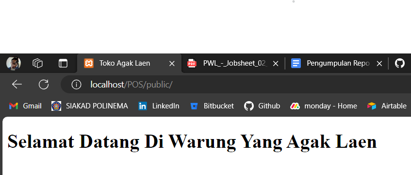
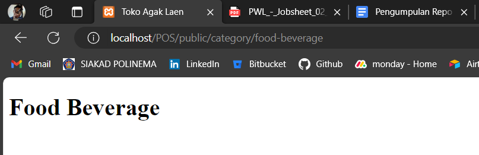
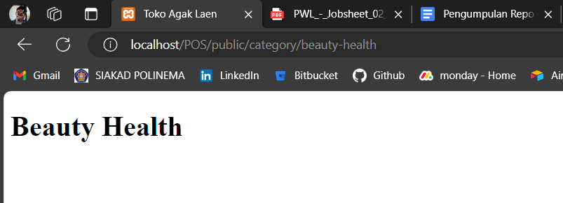
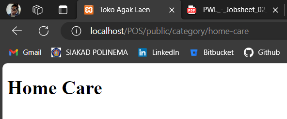
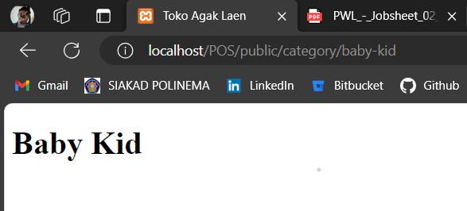
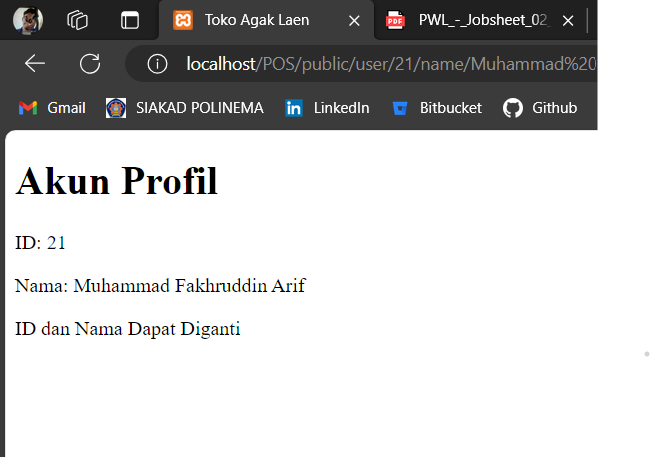
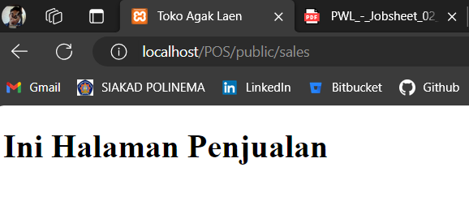

# Jobsheet 2: Routing, Controller, Dan View (Tugas)
> Nama  : Muhammad Fakhruddin Arif
>
> Kelas : TI-2F
>
> Nomor : 21

## Code
1. Routes
```php
// Home
Route::get('/', [\App\Http\Controllers\HomeController::class, 'show']);

// Prefix Category
Route::prefix('category')->group(function () {
    Route::get('/food-beverage', [\App\Http\Controllers\CategoryController::class, 'showFoodBeverage']);
    Route::get('/beauty-health', [\App\Http\Controllers\CategoryController::class, 'showBeautyHealth']);
    Route::get('/home-care', [\App\Http\Controllers\CategoryController::class, 'showHomeCare']);
    Route::get('/baby-kid', [\App\Http\Controllers\CategoryController::class, 'showBabyKid']);
});

// Route Param id and name user
Route::get('/user/{id}/name/{name}', [\App\Http\Controllers\UserProfileController::class, 'show']);

// Route Sales
Route::get('/sales', [\App\Http\Controllers\SalesController::class, 'show']);
```
2. Controllers
- HomeController
```php
<?php

namespace App\Http\Controllers;

use Illuminate\Http\Request;

class HomeController extends Controller
{
    public function show()
    {
        return view('home');
    }
}
```
- CategoryController
```php
<?php

namespace App\Http\Controllers;

use Illuminate\Http\Request;

class CategoryController extends Controller
{
    public function showFoodBeverage()
    {
        return view('products.foodBeverage');
    }

    public function showBeautyHealth()
    {
        return view('products.beautyHealth');
    }
    public function showHomeCare()
    {
        return view('products.homeCare');
    }
    public function showBabyKid()
    {
        return view('products.babyKid');
    }
}
```
- UserProfileCategory
```php
<?php

namespace App\Http\Controllers;

use Illuminate\Http\Request;

class UserProfileController extends Controller
{
    public function show($id, $name)
    {
        return view('userProfile')
            ->with('id', $id)
            ->with('name', $name);
    }
}
```
- SalesController
```php
<?php

namespace App\Http\Controllers;

use Illuminate\Http\Request;

class SalesController extends Controller
{
    public function show()
    {
        return view('sales');
    }
}
```
3. Views
- Layout
```php
<!doctype html>
<html lang="en">
<head>
    <meta charset="UTF-8">
    <meta name="viewport"
          content="width=device-width, user-scalable=no, initial-scale=1.0, maximum-scale=1.0, minimum-scale=1.0">
    <meta http-equiv="X-UA-Compatible" content="ie=edge">
    <title>Toko Agak Laen</title>
</head>
<body>
@yield('content')
</body>
</html>
```
- Home
```php
@extends('app')
@section('content')
    <h1>Selamat Datang Di Warung Yang Agak Laen</h1>
@endsection
```
- Products
1. foodBeverage
```php
@extends('app')
@section('content')
    <h1>Food Beverage</h1>
@endsection
```
2. beautyHealth
```php
@extends('app')
@section('content')
    <h1>Beauty Health</h1>
@endsection
```
3. homeCare
```php
@extends('app')
@section('content')
    <h1>Home Care</h1>
@endsection
```
4. babyKid
```php
@extends('app')
@section('content')
    <h1>Baby Kid</h1>
@endsection

```
- Profile
```php
@extends('app')
@section('content')
    <h1>Akun Profil</h1>
    <p>ID: {{ $id }}</p>
    <p>Nama: {{ $name }}</p>
    <span>ID dan Nama Dapat Diganti</span>
@endsection
```
- Sales
```php
@extends('app')
@section('content')
    <h1>Ini Halaman Penjualan</h1>
@endsection
```
4. Output
- get:/

- get:/category/food-beverage
  
- get:/category/beauty-health
  
- get:/category/home-care
  
- get:/category/baby-kid
  
- get:/user/{id}/name/{name}
  
- get:/sales
  
